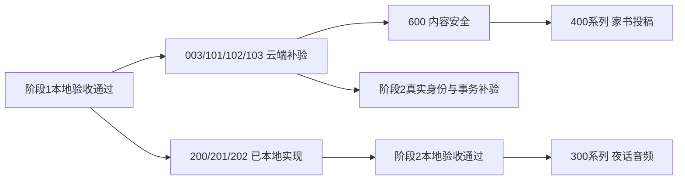

# 仓库审计与阶段实施计划

更新：2026-09-15。**阶段 2（TASK-200～202）本地验收通过。** 阶段 1 本地验收已通过，真实云与手机验收仍待办。用户已确认暂时没有可用的正式小程序 AppID 和关联 CloudBase 环境，先完成本地开发。

## 1. 仓库与当前工程

| 项目                | 实际结果                                                                                                                            |
| ------------------- | ----------------------------------------------------------------------------------------------------------------------------------- |
| 本地项目            | `shixueyehua/` 仓库根目录                                                                                                           |
| 来源                | `https://github.com/Chatblanccc/shixueyehua.git`                                                                                    |
| 初次导入分支 / 提交 | `main`，`bfc49a87bebd5b974807c17b50031748639d40ee`                                                                                  |
| 当前本地分支        | `codex/stage-2-identity-classes`；阶段 2 尚未推送，未运行本阶段 CI                                                                  |
| 初次克隆            | 空目录导入文档仓库；原仓库没有页面、云函数、依赖或测试                                                                              |
| 文档准备            | 规则和 Markdown 基线归位；产品、路线图、技术栈、开发指引和导航补齐；2 份 Word 原件保留                                              |
| 当前源码            | `miniprogram/`、`shared/`、`cloudfunctions/`、`scripts/`、`tests/`                                                                  |
| 当前工具            | 验证使用 Node `24.21.0`；微信开发者工具 Stable `2.02.2608070`、基础库 `3.17.3`                                                      |
| 微信与云            | 开发者工具已登录；现有测试 AppID 查询云环境返回 `ret=-601059`“测试号不能使用云服务”                                                 |
| 远端交付            | 阶段 1 经 [PR #1](https://github.com/Chatblanccc/shixueyehua/pull/1) 合并至 main，提交 `20a5681`，GitHub Actions 通过；未部署云环境 |

初次审计时“没有源码、检查因 package.json 不存在未运行”是历史状态。当前命令见[开发指引](DEVELOPMENT.md)，阶段 1 历史结果见[测试记录](test-cases.md)，阶段 2 结果见第 5 节与[第二阶段说明](stage-2.md)。

## 2. 阶段 0 与阶段 1 执行结果

任务书阶段 1 仍指 `TASK-100～103`，阶段 0 是其工程前置。以下表格与第 3 / 4 节保留阶段 1 的历史验收和计数，不作为阶段 2 的新增结果；本地通过不等于真实云验收完成。

| TASK                    | 状态                   | 主要修改文件 / 目录                                                                         | 本地证据与剩余边界                                                                                                                   |
| ----------------------- | ---------------------- | ------------------------------------------------------------------------------------------- | ------------------------------------------------------------------------------------------------------------------------------------ |
| TASK-000 仓库审计       | 完成                   | README、AGENTS、docs                                                                        | 来源和历史原件保留，基线差异见 decisions                                                                                             |
| TASK-001 工程初始化     | 本地验收通过           | project.config.json、miniprogram/app.*、pages、package-admin、assets                        | 原生 TS、TDesign、四 Tab、14 页及分包；微信 npm 构建成功；模拟器启动 / Tab / 七管理页守卫检查通过                                    |
| TASK-002 质量工具       | 本地验收通过           | package 与锁文件、tsconfig.*、eslint / prettier / vitest 配置、vendor                       | lint、三套严格类型检查、13 文件 / 124 项测试、格式检查及构建通过；生产 / 实际部署包 / 小程序依赖审计为 0；剩余开发依赖见下文         |
| TASK-003 环境配置       | 本地验收通过；云端待验 | config、scripts/prepare-local.ts、miniprogram/config、云运行时                              | dev / test / prod 显式配置；只有未配置云的 dev 允许页面预览；真实环境健康检查待验                                                    |
| TASK-100 共享类型与接口 | 本地验收通过           | shared、miniprogram/services/cloud-client.ts                                                | 领域类型、错误码、白名单 DTO、统一调用、超时与异常响应测试通过                                                                       |
| TASK-101 云函数共享内核 | 本地验收通过；云端待验 | cloudfunctions/_shared、六函数入口、scripts/build-cloud.ts、scripts/check-cloud-packages.ts | 可信上下文、角色和学校范围、校验 / 审计 / 分页、SDK 回执验证；六个实际部署包含 vendor，在仓库外按锁文件安装、加载、审计通过          |
| TASK-102 数据初始化     | 本地验收通过；云端待验 | scripts/database、database/rules、tests/database                                            | 13 集合 / 24 索引清单、默认拒绝规则、幂等种子、事务首次授权、写入回执验证；数据库本地测试与两个 dry-run 通过，未执行 apply           |
| TASK-103 登录与会话     | 本地验收通过；云端待验 | authApi/login、客户端 auth / session / user.store、tests                                    | 原子建用户、并发与回执恢复、DTO、MobX、引导 / 权限守卫、超时和陈旧响应隔离；七管理页实际退回启动页且能恢复预览；真实微信身份联调待验 |

没有云配置时，启动页可进入四 Tab 预览；`user` 保持空，不能获得管理员权限。阶段 1 交付时身份 / 选班页和管理分包为有效占位；本轮已推进身份选班与权限守卫，见第 5 节。音频、投稿、审核及具体管理动作仍未实现，返回明确的 `NOT_IMPLEMENTED`。

### 本轮修复与独立复核

- 云函数数据库适配器确认新增用户和审计回执，拒绝带 SDK 错误标记的查询结果，避免未确认写入或错误 health 假成功。
- 数据初始化与首次超管事务确认 `updated` / `upserted` 回执；所有非空删除标记均拒绝授权。
- 会话清空后允许立即重登，旧请求不会清理新请求；管理员导航使用真实回调与页面栈验证，重定向及预览恢复回归通过。
- 云包携带实际运行锁文件和 vendor，验证包内依赖的一致性与独立安装；生产依赖补丁另有 7 项专项兼容测试。

服务端 / 数据库复核、3 项修复及 96 项目标测试见[独立验收复核](acceptance-review.md)。客户端 21 项与依赖专项 7 项合计形成全仓 124 项测试，详见[测试记录](test-cases.md)。

## 3. 阶段 1 历史本地验收证据

| 检查                                 | 当前结果                                                                                                   |
| ------------------------------------ | ---------------------------------------------------------------------------------------------------------- |
| 完整质量入口 `npm run verify`        | 通过：lint、三个 TypeScript 配置、13 文件 / 124 项测试、构建与项目结构检查                                 |
| `npm run format:check`               | 通过                                                                                                       |
| `npm run check:cloud`                | 六个最新实际部署包包含一致的清单 / 锁文件 / vendor；仓库外生产安装、逐一加载 `main` 与实际部署依赖审计通过 |
| 数据库与首位超管 dry-run             | 两命令退出码 0，`cloudContacted=false`，无真实数据变更                                                     |
| 根生产 / 实际部署包 / 小程序依赖审计 | 均为 0，退出码 0                                                                                           |
| 根全量依赖审计                       | 17 项 moderate、0 high、0 critical；退出码 1，不能称全部依赖审计通过                                       |
| 微信模拟器                           | 2026-09-15 **22:59:55（北京时间）**：12 项检查全部通过，异常 0                                             |

模拟器 12 项包括启动页、四个 Tab 和七个管理页；管理页检查等待导航回调完成并确认实际页面栈返回启动页，没有创建用户，随后再次点击预览可恢复使用。对应生成报告为 `artifacts/devtools/verification.json`，报告仍明确 `cloudVerified=false`、`deviceVerified=false`。旧的管理员重定向失败已修复，不再作为当前失败项。

已建立统一命令：

```bash
npm run verify:stage1
```

它串联完整质量检查、格式检查、实际云包检查、两个数据库 dry-run、根及小程序生产依赖审计和模拟器检查。**各子命令已实际验证**；本记录不把新串联命令的存在当成额外一次执行证据。运行条件见[开发指引](DEVELOPMENT.md)。该命令不会部署云函数或执行数据库 `--apply`。

## 4. 第一阶段验收清单

| 编号  | 检查           | 本地证据                                                                          | 尚需真实验收                                        |
| ----- | -------------- | --------------------------------------------------------------------------------- | --------------------------------------------------- |
| S1-01 | 工程与质量命令 | 微信 npm 构建；lint / typecheck / 124 tests / build / format；12 项模拟器检查通过 | 手机设备布局与兼容性随后续业务验收                  |
| S1-02 | 云环境与独立包 | 六包从最新产物按运行锁安装 SDK / vendor，在仓库外加载并审计通过                   | 实际部署、平台运行时和 health requestId             |
| S1-03 | 登录唯一性     | 原子创建、重复 / 并发、冲突与不确定响应恢复、回执校验                             | 真实账号并发登录只产生一条用户记录                  |
| S1-04 | 身份可信       | SDK 身份边界、伪造输入与 DTO 白名单测试                                           | 真实微信 SDK 上下文不可伪造验收                     |
| S1-05 | 角色与范围     | 跨校、切校、禁用、删除与撤权测试；七管理页拒绝导航                                | 云端每次请求重查授权和真实账号状态                  |
| S1-06 | 会话与页面     | loading、重试、超时、稳定引导、迟到响应隔离及预览恢复                             | 真实登录至身份 / 班级页面                           |
| S1-07 | 初始化幂等     | 数据库脚本测试、事务回执与两个 dry-run                                            | 开发环境重复执行、唯一索引生效、首次授权事务        |
| S1-08 | 客户端直连防护 | 默认拒绝规则、部署和回读实现、非法返回拒绝                                        | 数据库与存储真实直接访问均被拒绝                    |
| S1-09 | 可维护性与依赖 | 锁文件、显式配置、构建和接口文档；生产与实际部署依赖审计为 0                      | 部署前再次审计并复核剩余开发依赖；验证真实 SDK 兼容 |

## 5. 阶段 2 本地验收与真实验收待办

| TASK           | 已实现内容与主要文件                                                                                                                                                                | 当前状态                       |
| -------------- | ----------------------------------------------------------------------------------------------------------------------------------------------------------------------------------- | ------------------------------ |
| 200 身份资料   | `pages/onboarding/`、`services/profile-controller.ts`、`authApi/profile.ts`：三种身份、昵称、内置 avatarPreset、账号隔离草稿、字段白名单和事务审计；自定义头像上传未做              | 本地验收通过；真实云与真机待验 |
| 201 班级选择   | `pages/class-select/`、`services/class*.ts`、`classApi/classes.ts`、`_shared/db.ts`：CursorPage 目录、三级联动、层级校验、成员事务、当前班级 null 失效语义及 scopeRevision 缓存隔离 | 本地验收通过；真实云与真机待验 |
| 202 管理员守卫 | `services/admin-guard.ts`、`services/session-controller.ts`、`package-admin/`：onLoad / onShow 强制刷新、旧请求隔离、操作拒绝后退出、超管页面限制                                   | 本地验收通过；真实云与真机待验 |

2026-09-15 **23:43:33（北京时间）**，Node `24.21.0` 下最后重跑的 `verify`、`format:check` 退出 0：19 个测试文件 / **235 项测试**，以及 lint、三套严格类型检查、构建和格式检查通过。本地日志为 `artifacts/acceptance/stage2-quality.log`。`check:cloud` 首次因 npm TLS 中断，单独重试退出 0，六个实际云包仓库外安装 / 加载 / 审计通过，重试日志为 `artifacts/acceptance/stage2-cloud-retry.log`。两个数据库 dry-run 与根 / 小程序生产依赖审计也分别退出 0，未执行云端变更。

同日 **23:46:14（北京时间）**，阶段 2 模拟器 15 项检查全部通过，异常为 0；报告 `artifacts/devtools-stage2/verification.json` 为 `status=passed`，仍明确 `cloudVerified=false`、`deviceVerified=false`。检查包含原有 12 项启动 / Tab / 管理守卫导航，以及资料表单、无云预览边界、返回并重开后的草稿恢复。上述生成日志与报告均不提交，不覆盖阶段 1 历史证据。

当前本地验收入口为 `npm run verify:stage2`；各子命令已分别实际运行通过，未记录整条串联命令一次退出 0。本阶段位于本地分支 `codex/stage-2-identity-classes`，尚未推送或运行本阶段 CI。

完整 API、成员历史规则、头像范围与验证明细见[第二阶段说明](stage-2.md)。夜话 / 家书页接收范围变化通知，但真实音频和家书列表仍在阶段 3 / 4 开发。当前没有真实云调用或真机结果。

## 6. 后续顺序与剩余边界

| 阶段               | TASK                         | 当前状态 / 依赖                                                    |
| ------------------ | ---------------------------- | ------------------------------------------------------------------ |
| 云端补验           | 003、101、102、103           | 等待可用真实 AppID 和 dev 环境；按数据库、规则、登录与授权顺序补验 |
| 2 身份与选班       | 200、201、202                | 本地验收通过；真实云与真机待验，详见 stage-2.md                    |
| 3 夜话音频         | 300、301、302、303、304、305 | 下一步从 TASK-300 开始；尚未实现，只有夜话空态页面                 |
| 4 一封家书         | 400、401、402、403、404、405 | 尚未实现；只有家书空态页面                                         |
| 5 管理中心         | 500、501、502、503、504      | 尚未实现；只有分包占位与权限入口守卫                               |
| 6 安全、体验与发布 | 600、601、602、603、604      | 尚未验收；初始数据库 / 存储拒绝规则代码已随 102 交付               |



- 用户暂无云配置，本轮不创建云资源、不部署、不初始化真实数据库、不授权真实账号。
- [依赖审计](dependency-audit.md)已记录生产补丁及兼容验证；全量开发依赖剩余 17 项 moderate，不能表述为所有安全风险已清除。进入真实部署前须重新审计并复核剩余项。
- 真实微信身份、云端规则 / 唯一索引 / 事务、手机、平台审核与发布均未验收。模拟器和本地替身不能替代这些证据。
- 初次初始化就部署默认拒绝规则；上传开发时按 TASK-601 逐项开放最小权限。TASK-600 内容安全必须先于 TASK-400 真实投稿。
- 首位超管须先经真实微信登录生成用户，再通过服务端可信记录受控授权；用户自选 `currentSchoolId` 不影响 `adminSchoolId`。
- P1 保留在 V0.1 范围；公开家书上线前必须完成举报处置。

真实云就绪后按[开发指引](DEVELOPMENT.md)、[数据库指引](database.md)、[安全规则](security-rules.md)、[云函数接口](cloud-functions.md)和[独立复核待验清单](acceptance-review.md)补验。每个 TASK 继续记录修改文件、检查结果、环境与未验证边界；不记录密钥或真实用户内容。
